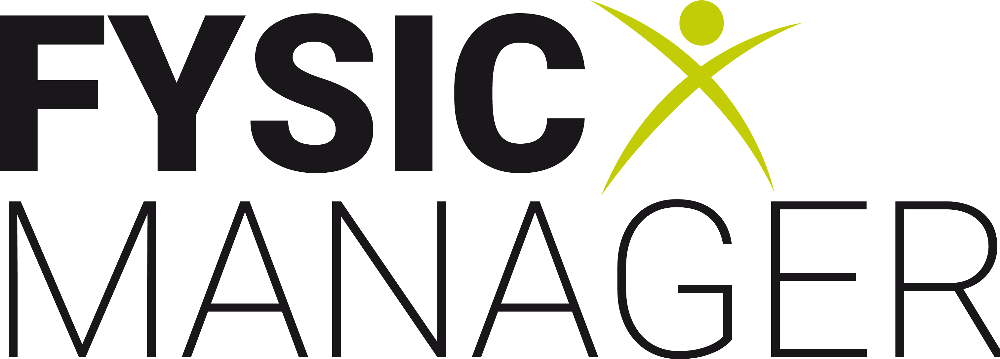

<div align="center">
  
</div>

# FysicManager Client

A modern React application for managing physiotherapy practices, appointments, and patients.

## Project Overview

FysicManager Client is a web application built with React and TypeScript that provides an intuitive interface for physiotherapy practices. The application enables users to efficiently manage therapists, patients, appointments, practices, and work schedules.

This client application works in conjunction with the [FysicManager-API](https://github.com/Daanylo/FysicManager-API) backend to provide a complete practice management solution.

### Key Features

- **📅 Appointment Scheduling**: Visual scheduling with drag-and-drop functionality
- **👥 Patient Management**: Comprehensive patient management with search functionality
- **🏥 Practice Management**: Management of multiple practice locations
- **👨‍⚕️ Therapist Management**: Therapists with specializations and work schedules
- **⚙️ Admin Panel**: Central management interface for all entities
- **🗓️ Calendar Integration**: Integrated calendar view

## Technology Stack

- **Frontend Framework**: React 18 with TypeScript
- **UI Library**: Material-UI (MUI)
- **Date Handling**: date-fns for date manipulation
- **State Management**: React Hooks
- **HTTP Client**: Axios for API communication
- **Build Tool**: Create React App

## API Integration

The application communicates with a .NET backend API via RESTful endpoints. For complete API documentation and backend setup, see the [Daanylo-FysicManager-API](https://github.com/Daanylo/FysicManager-API) repository.

All API services are organized in the `src/services/` directory:

### API Services

- **`appointmentAPI.ts`**: CRUD operations for appointments
- **`patientAPI.ts`**: Patient search, creation, and updates
- **`therapistAPI.ts`**: Therapist management and filtering
- **`practiceAPI.ts`**: Practice information and therapist assignments
- **`specializationAPI.ts`**: Specialization management
- **`appointmentTypeAPI.ts`**: Appointment type configuration
- **`workshiftAPI.ts`**: Work schedule management

### API Configuration

The API base URL is configured in `src/config/environment.ts`:

```typescript
export const API_BASE_URL = 'https://localhost:7132/api';
```

### Type Safety

The project uses TypeScript interfaces for type safety:

- **Core Types**: `src/types/` - Main entities (Patient, Therapist, Appointment, etc.)
- **Simple Types**: `src/types/Simple/` - Simplified versions for API communication

## Project Structure

```
src/
├── components/          # Reusable React components
│   └── schedule/       # Scheduling-related components
├── pages/              # Main page components
├── services/           # API service layer
├── types/              # TypeScript type definitions
├── config/             # Configuration files
└── App.tsx            # Main application component
```

### Important Components

- **`ScheduleView`**: Main scheduling interface
- **`AdminPanel`**: Management interface for all entities
- **`CreateAppointment`**: Appointment creation form
- **`EditAppointment`**: Appointment editing form

## Installation and Setup

### Prerequisites

- Node.js (version 16 or higher)
- npm or yarn
- A running instance of the [Fysic Manager API](https://github.com/Daanylo/FysicManager-API)

### Installation

1. Clone the repository:
```bash
git clone <repository-url>
cd FysicManager-Client
```

2. Install dependencies:
```bash
npm install
```

3. Configure the API URL in `src/config/environment.ts`

4. Start the development server:
```bash
npm start
```

The application now runs on [http://localhost:3000](http://localhost:3000)

## Available Scripts

### `npm start`
Starts the application in development mode. The page automatically reloads when changes are made.

### `npm test`
Starts the test runner in interactive watch mode.

### `npm run build`
Builds the application for production to the `build` folder. The build is optimized for best performance.

### `npm run eject`
**Warning: this is a one-way operation!**

Eject reveals all configuration files for full control over the build setup.

## Features in Detail

### Scheduling Interface
- **Time-slot based display**: Therapists as columns, time slots as rows
- **Visual appointment blocks**: Color-coded based on appointment type
- **Interactive appointment creation**: Click on available time slots
- **Real-time updates**: Automatic refresh when changes occur

### Patient Management
- **Advanced search**: Search by name, phone, email, or BSN
- **Autocomplete functionality**: Quick patient selection
- **Comprehensive patient profiles**: Contact details and appointment history
- **Inline editing**: Direct updates via modal dialogs

### Admin Panel
- **Tab-based interface**: Separate sections per entity type
- **CRUD operations**: Complete management of all data
- **Bulk actions**: Efficient management of multiple items
- **Validation**: Client-side and server-side validation

## Development

### Code Structure
- **Component-based architecture**: Modular, reusable components
- **Service layer**: Separated API logic
- **Type-safe**: Full TypeScript support
- **Material Design**: Consistent UI/UX

### Styling
- **Material-UI theming**: Custom color schemes
- **Responsive design**: Works on desktop and tablet
- **Dutch interface**: Fully translated user interface

### Error Handling
- **Graceful degradation**: Elegant error handling
- **User feedback**: Clear error and success messages
- **Retry mechanisms**: Automatic reconnection on network errors

## Deployment

For production deployment:

1. Build the application:
```bash
npm run build
```

2. Serve the `build` folder with a static web server
3. Configure the API URL for production environment
4. Ensure the [backend API](https://github.com/Daanylo/FysicManager-API) is accessible

## Related Repositories

- **Backend API**: [FysicManager-API](https://github.com/Daanylo/FysicManager-API) - .NET Core Web API providing the backend services

## Support

For questions about implementation or usage of this application, consult the API documentation in the [backend repository](https://github.com/Daanylo/FysicManager-API) or contact the development team.

<div align="center">
    
</div>
